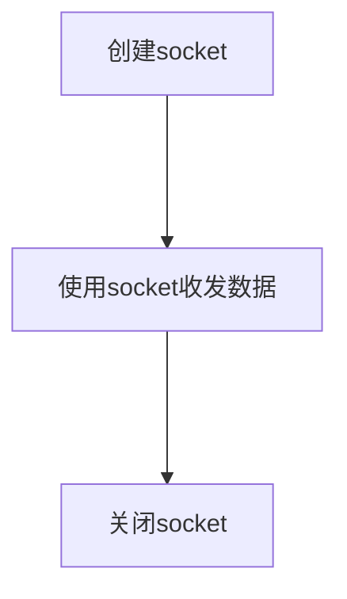

<body>
    <script src="https://cdn.jsdelivr.net/npm/mermaid/dist/mermaid.min.js"></script>
</body>

# IP地址
## 目的:标记网络上的一台电脑
## 不允许重复
## 在Linux查看IP ifconfig
## inet IP地址
## 类型
- ## IPv4 (已枯竭)
- ## IPv6 

# 端口
## 分类
### 知名端口(Well known Ports) 
### 动态端口(Dynamic Ports) 1024-65535 
## 查看端口
## netstat -an 查看端口状态
tcp_socket = socket.socket(socket.AF_INET, socket.SOCK_STREAM)

# Socket
## 进程间通信的一种方式, 实现不同主机间的进程间通信
## 完成网络通信必备的东西

## 创建TCP socket套接字
```
import socket

# socket.socket(AddressFamily, Type)

tcp_socket = socket.socket(socket.AF_INET, socket.SOCK_STREAM)
```

## 创建UDP socket套接字
```
import socket
udp_socket = socket.socket(socket.AF_INET, socket.SOCK_DGRAM)
localaddr = ("", 6789) # local port
```

## 收发数据
```
udp_socket.sendto("xxxx".encode('utf-8'), ('IP', port))
udp_socket.recvfrom(1024)
```

## 关闭socket
```
udp_socket.close()
```

## 如何使用socket 总结

