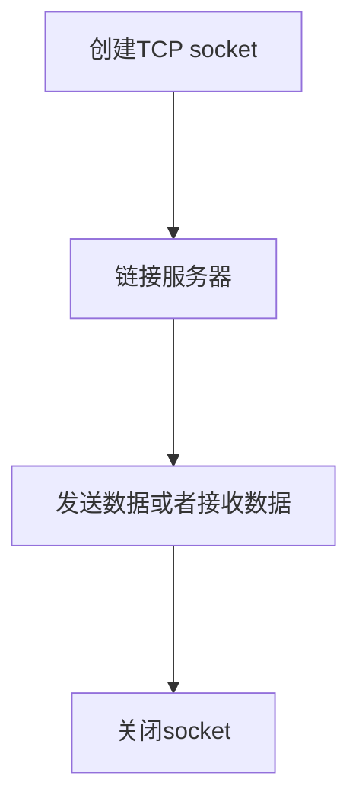
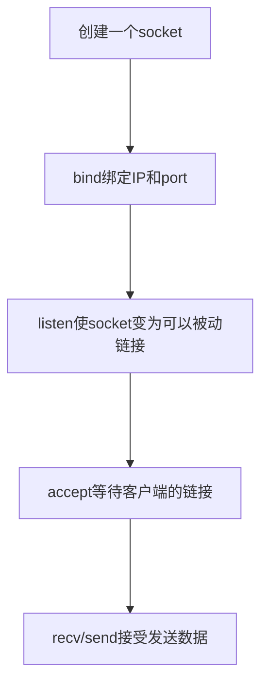

<body>
    
</body>

# TCP Client
## 实例代码 (见TCP_Client.py)
## 步骤

# TCP Server
## 实例代码 (见TCP_Server.py)
## 步骤

## 生活中的电话机
## 如果想让别人能打通我们的电话，需要做以下几个事情
### 1. 买个手机
### 2. 插上电话卡
### 3. 设计手机为正常接听状态
### 4. 静静的等待别人拨打